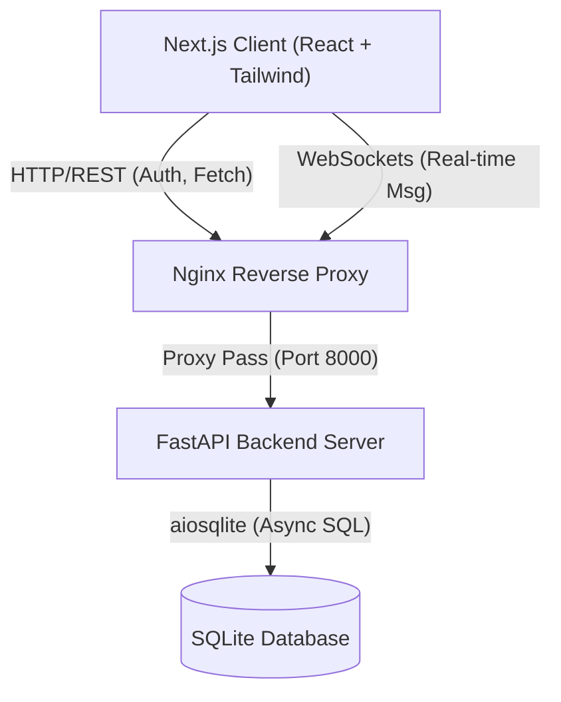
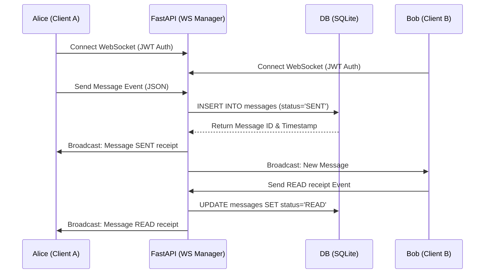
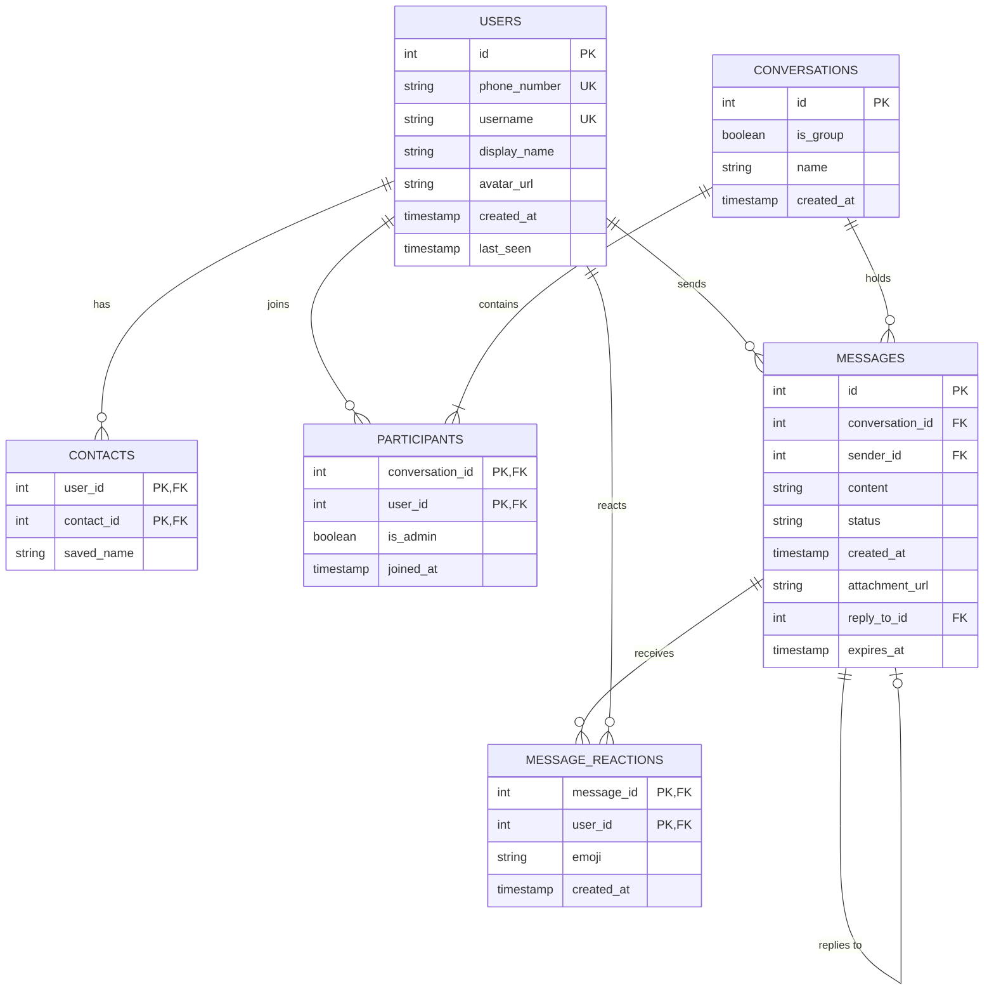

# Signal Web Clone

A high-fidelity desktop web clone of Signal Messenger, built with a modern, modular architecture. It emphasizes privacy UX, clean typography, low-latency messaging, and UI parity with the original desktop app.

## Features

- **Pixel-Perfect Signal UI**: Faithfully recreates the modern Signal desktop client design using Tailwind CSS, complete with custom palettes, fonts (Inter, JetBrains Mono), and micro-interactions.
- **Real-Time Messaging**: Bidirectional WebSocket integration for low-latency message streaming.
- **Stateless Authentication**: JWT-based session management simulating a phone/OTP registration flow.
- **Asynchronous Backend**: Powered by FastAPI and `aiosqlite` for high-throughput concurrency.
- **Delivery States**: UI readiness for SENT, DELIVERED, and READ message receipts.
- **Encrypted UI Paradigms**: Features mock elements for End-to-End Encryption (E2EE), Safety Numbers, and cryptographic footprints to mirror Signal's privacy-focused interface.

## Tech Stack

### Frontend
- Next.js (App Router)
- React 18
- Tailwind CSS
- TypeScript

### Backend
- FastAPI
- WebSockets
- aiosqlite (Async SQLite Database)
- PyJWT & Passlib (Authentication)

## Local Development Setup

### 1. Backend

Navigate to the backend directory and set up a Python virtual environment:

```bash
cd backend
python -m venv venv
source venv/bin/activate
pip install -r requirements.txt
```

Initialize and seed the database with mock users and conversations:
```bash
python app/db/seed.py
```

Start the FastAPI server:
```bash
uvicorn app.main:app --reload --host 0.0.0.0 --port 8000
```
The backend API will be running at `http://localhost:8000`.

### 2. Frontend

Open a new terminal, navigate to the frontend directory, and install dependencies:

```bash
cd frontend
npm install
```

Start the Next.js development server:
```bash
npm run dev
```
The application will be running at `http://localhost:3000`.

## Testing the App

1. Open `http://localhost:3000` in your browser.
2. The seed script pre-populated the database with three mock users. Log in with the following credentials:
   - **Phone**: `1111111111` (Sarah Chen) or `2222222222` (Alex Rivera)
   - **OTP Code**: `1234` (Mock static passcode)
3. You will immediately see the beautifully rendered Signal chat interface.

## 1. High-Level Architecture

The application follows a modern decoupled architecture consisting of a frontend client, a backend API/WebSocket server, and a SQLite database.



### Components
1. **Frontend (Client Layer)**: 
   - Framework: Next.js (App Router), React 18, Tailwind CSS.
   - Manages UI state, handles WebSocket connections (`SocketContext`), and provides native-feeling components mimicking the Signal desktop application.
2. **Backend (Application Layer)**: 
   - Framework: FastAPI (Python).
   - Handles REST API requests (Authentication, User Search, Conversation History).
   - Maintains persistent WebSocket connections for real-time bidirectional message broadcasting.
3. **Database (Data Layer)**: 
   - Framework: SQLite via `aiosqlite`.
   - Chosen for simplicity and ease of portability. Highly normalized schema.
4. **Proxy Layer**:
   - Framework: Nginx.
   - Routes incoming traffic, handles CORS, and correctly proxies HTTP Upgrade requests for WebSockets.

---

## 2. Real-Time Messaging Flow

The core feature of the application is low-latency, real-time messaging using WebSockets.



### WebSocket Manager (`ws_manager.py`)
- Maintains an in-memory dictionary mapping `user_id` to `WebSocket` objects.
- When a message is sent, the manager looks up the active WebSocket connections of all participants in that conversation and routes the message payload directly to them.
- Supports typing indicators, emoji reactions, and delivery/read receipts dynamically.

---

## 3. Database Schema (Entity-Relationship Diagram)

The database is highly normalized to support both 1-on-1 and Group conversations, contact lists, and message metadata (attachments, disappearing messages, reactions).



### Key Design Decisions
- **Unified Conversation Table**: Both direct chats and group chats share the `conversations` table. The `is_group` boolean flag dictates how the UI renders the chat name (i.e., falling back to the other participant's name for 1-on-1s).
- **Participants Mapping**: A many-to-many join table allows conversations to have `n` participants, paving the way for seamless group chats and administrative privileges (`is_admin`).
- **Contacts Mapping**: A self-referencing many-to-many mapping on the `users` table, allowing each user to locally customize their contact's `saved_name`.

---

## 4. Authentication Strategy

Because real end-to-end encryption (E2EE) and physical OTP SMS delivery are out-of-scope for the assignment, the authentication flow uses stateless JSON Web Tokens (JWT).

1. **Registration/Login**: User submits identifier (phone or username) and OTP to the `/api/auth` endpoint.
2. **Validation**: The backend verifies the static OTP (`1234`), checks the DB, and generates a JWT signed with `HS256`.
3. **Persistence**: The token is stored in the browser's memory/localStorage and appended to the `Authorization: Bearer <token>` header for all future REST API calls.
4. **WebSocket Auth**: Since WebSockets do not natively support custom headers in the browser API, the token is passed as a query parameter `ws://url?token=<jwt>` and authenticated immediately upon connection.

---

## 5. Deployment Architecture

The application is deployed using Docker Compose on an AWS EC2 instance.

- **Continuous Integration (CI/CD)**: GitHub Actions listens for pushes to the `main` branch. It connects to the EC2 instance via SSH and pulls the latest code.
- **Docker Orchestration**: `docker-compose.yml` spins up three isolated containers:
  - `frontend`: Next.js production build.
  - `backend`: Uvicorn/FastAPI server.
  - `nginx`: Reverse proxy facing the public internet (Port 80).
- **Data Persistence**: The SQLite file (`signal_v2.db`) is mapped to a persistent Docker Volume (`/app/data`), ensuring that container rebuilds do not wipe out user accounts, message history, or uploaded attachments.

## API Overview

The backend exposes clean, RESTful endpoints grouped by domain:
- **`POST /api/auth/login`**: Authenticate via phone/OTP and receive JWT.
- **`POST /api/auth/register`**: Create a new user identity.
- **`GET /api/users/me`**: Fetch current user profile.
- **`GET /api/users/search?q={query}`**: Find contacts by username.
- **`GET /api/conversations/`**: List all active conversations for the current user.
- **`POST /api/conversations/direct`**: Create/fetch a 1-on-1 chat.
- **`POST /api/conversations/group`**: Create a new group chat with members.
- **`GET /api/messages/{conversation_id}`**: Fetch historical messages for a chat.
- **`WS /api/messages/ws?token={jwt}`**: Persistent WebSocket connection for real-time messaging, typing indicators, and read receipts.
